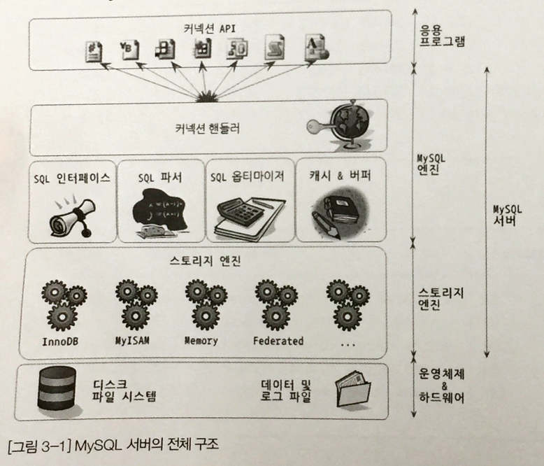
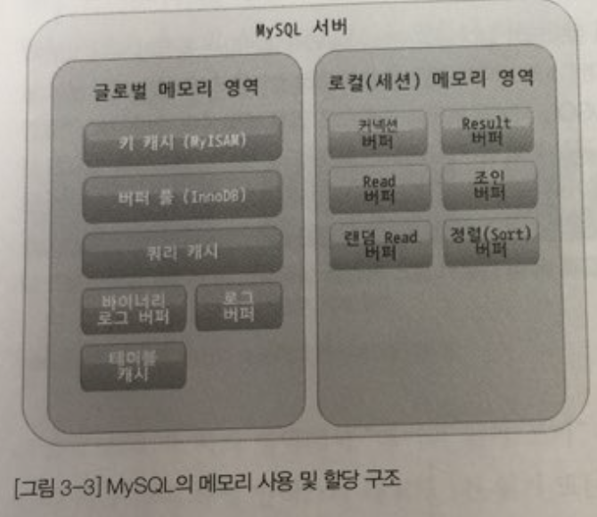
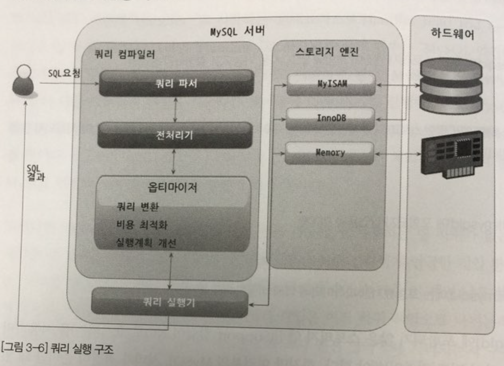
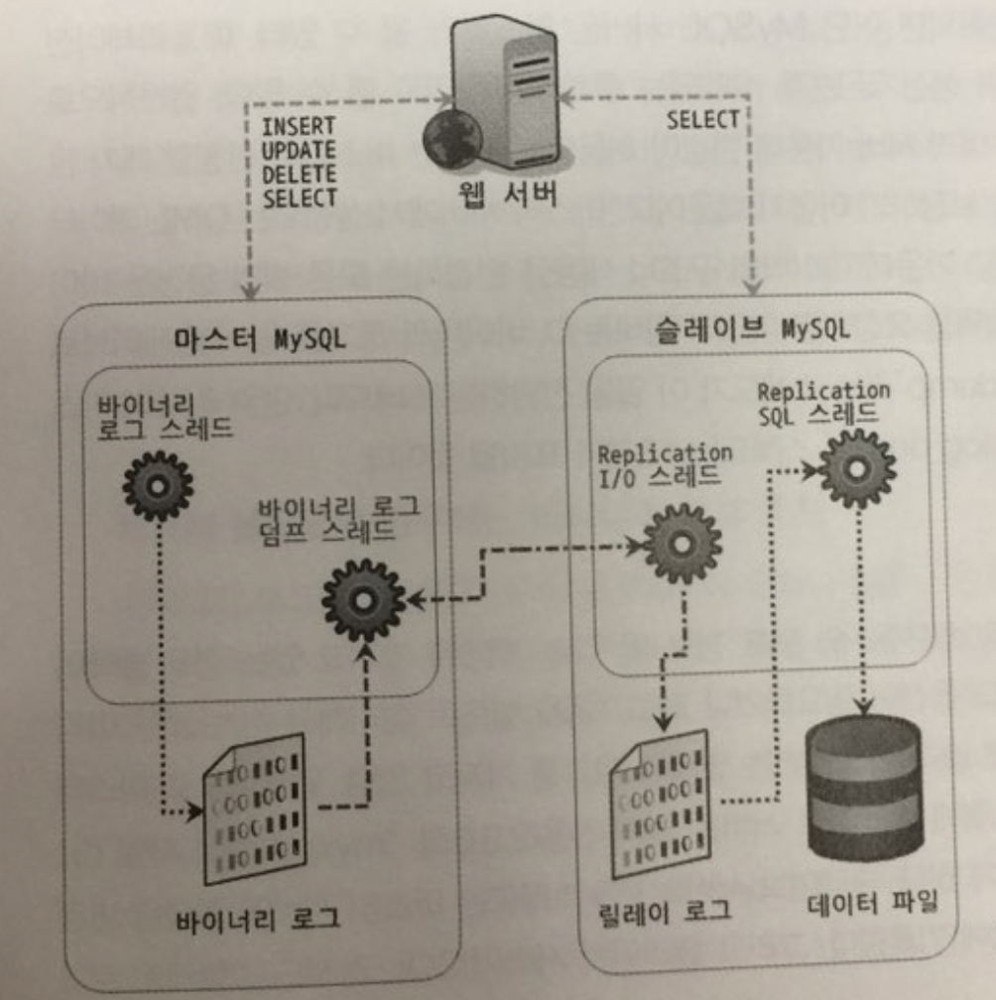
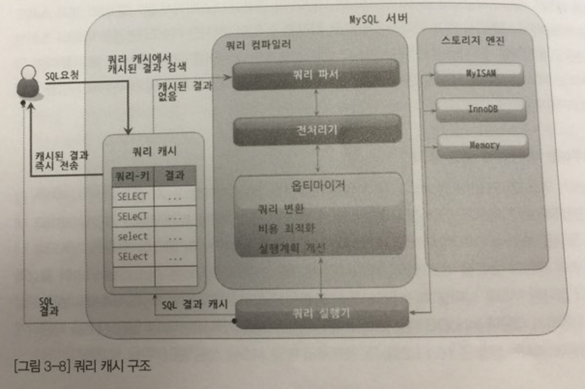

# 3장. 아키텍처
#스터디/MySQL

- 내용중 `NDB`의 내용은 생략합니다.

- - - -
## MySQL아키텍처
#### MySQL의 전체 구조

- MySQL은 크게 `MySQL엔진`과 `스토리지 엔진`으로 구분해서 볼 수 있다.
	- `MySQL엔진`은 책에서 `스토리지 엔진`과 구분하기 위해 개념적으로 묶은 것임
- `MySQL엔진`
	- 클라이언트 접속을 처리하는 커넥션 핸들러와 SQL 파서, 전처리기 그리고 옵티마이저가 중심을 이룬다.
	- `스토리지 엔진`에서 사용하는 보조 저장소도 `MySQL엔진`에 위치한다.(InnoDB버퍼풀 등)
- `스토리지 엔진`
	- 실제 데이터를 디스크에 쓰거나 디스크로부터 데이터를 읽어오는 부분을 전담한다.
	- MySQL 서버내에 `MySQL엔진`은 한개만 존재하지만 `스토리지 엔진`의 경우 여러개가 존재한다.
		- 테이블 마다 ENGINE을 다르게 설정할 수 있는 이유

#### MySQL의 쓰레딩 구조
- MySQL은 프로세스 기반이 아니라 쓰레드 기반으로 동작한다.
- 포그라운드 스레드(클라이언트 쓰레드)
	- 포그라운드 스레드는 접속한 클라이언트의 수만큼 존재한다.
		- 클라이언트의 쿼리를 처리하는 것이 임무.
		- 연결이 끊어지면 Thread pool로 돌아간다.
	- 테이블별로 동작이 다르다.
		- MyISAM의 경우 디스크에 쓰기까지 이 쓰레드에서 처리한다.
		- InnoDB같은 경우 버퍼에 넣고 실제 쓰기는 백그라운드에서 처리한다.
- 백그라운드 스레드
	- InnoDB의 여러가지 작업들을 담당
		- 인서트 버퍼 머지 쓰레드
		- 로그 쓰레드
		- 등등

#### 메모리 할당 및 사용 구조

- MySQL의 메모리 공간은 크게 `글로벌 메모리 영역`과 `로컬 메모리 영역`이 있다.
- `글로벌 메모리 영역`
	- MySQL이 시작될때 운영체제한테 할당받음.
	- 요청한 메모리영역을 한번에 받을 수도 필요할때마다 조금씩 받을지는 OS가 결정함 -> 때문에 정확히 메모리 사용량 측정이 힘듬.
	- 모든 쓰레드에서 공유하는 메모리 영역
- `로컬 메모리 영역`
	- 클라이언트 쓰레드가 쿼리를 처리하는 데 사용한다.
		- 정렬 버퍼, 조인 버퍼등등
	- 클라이언트 쓰레드마다 독립적은 메모리영역을 가진다.
		- 쿼리의 용도에 따라 아에 할당하지 않는 경우도 있다.
		- 클라이언트 연결이 끊기면 해당 메모리 영역이 해제된다.

#### 플러그인 스토리지 엔진 모델
- MySQL의 경우 커스텀기능을 만들고 싶을때 플러그인 형태로 제공할 수 있다.
``` 
## 참고 ##
- 복잡한 쿼리(Group By, Order By)의 경우 엔진이 아닌 쿼리실행기에서 처리한다.
- 쿼리가 어떤 영역에서 처리되는지 구분할줄 아는 것이 매우 중요하다.
```

#### 쿼리 실행 구조

- 쿼리 파서
	- SQL을 토큰(MySQL이 인식할 수 있는 최소단위)으로 분리한다.
	- SQL의 문법에러는 대부분 이 단계에서 걸러진다.
- 쿼리 전처리기
	- 파서를 통해 만들어진 파서 트리를 기반으로 문제가 있는지 검사한다.
	- 테이블 혹은 칼럼의 접근 권한이 있는지, 존재하는지 등등이 이 단계에서 걸러진다.
- 쿼리 옵티마이저
	- 쿼리를 저렴한 비용으로 빠르게 처리할 방법을 결정한다.
	- 책에서는 옵티마이저가 더 나은 선택을 하도록 유도하는 내용을 알려준다.
- 실행 엔진
	- 옵티마이저에서 만든 계획대로 실제로 실행하는 역할을 한다.
	- EX: Group By쿼리의 처리
		1. 핸들러에게 임시 테이블 만들라고 요청
		2. WHERE절에 일치하는 레코드를 읽어오라고 핸들러에게 요청
		3. 읽어온 레코드를 임시 테이블에 저장하라고 요청
		4. 임시 테이블에서 필요한 방식으로 다시 데이터를 읽어오라고 핸들러에게 요청
		5. 최종결과를 사용자 혹은 다른 모듈에 전달
- 핸들러(스토리지 엔진)
	- 가장 밑단에서 데이터에 실제적인 쓰기와 읽기를 담당한다.
	- 테이블의 ENGINE이 InnoDB면 InnoDB가 핸들러가 되고 MyISAM이라면 MyISAM이 핸들러가 된다.

#### 복제

- 2대 이상의 MySQL 서버를 운영할때 서버가 동일한 데이터를 담도록 동기화 하는 기술이다.
- 쓰기와 읽기의 역할로 구분해 각각 `Master`, `Slave`라고 부른다.
- `마스터(Master)`
	- 데이터의 구조나 변경이 일어나는 쿼리만 바이너리 로그에 기록한다.
	- 마스터에 붙은 슬레이브당 `Binlogdump 쓰레드`가 존재한다.
		- 쌓아둔 Binlog를 읽어서 슬레이브에 전달한다.
- `슬레이브(Slave)`
- 잘못 알고 있는점(주의사항)
	- 슬레이브는 하나의 마스터만 설정 가능
		- 슬레이브는 여러개의 마스터를 가질 수 있다.
	- 마스터와 슬레이브의 데이터 동기화를 위해 슬레이브는 읽기 전용으로 설정
		- 읽기 전용 아니여도됨 하지만 슬레이브 데이터에 쓰기가 발생헀을 때 처리를 생각하면 읽기 전용이 좋다.
	- 슬레이브 서버용 장비는 마스터와 동일한 사양이 적합
		- 슬레이브 서버가 마스터의 데이터를 따라가는건 싱글 스레드로 동작한다. 반면 마스터의 경우 멀티쓰레드로 쓰기를 할 수 있다.
			- 때문에 쓰기가 많은 데이터라면 슬레이브의 사양이 더 커야한다. 아니라면 같아도 된다.
	- 복제가 불필요한 경우에는 바이너리 로그 중지
		- 바이너리 로그는 자원이 굉장이 많이 필요한 작업중 하나이다. 복제를 안하면 꺼주도록 하자.
	- 바이너리 로그와 트랜잭션 격리 수준
		- MySQL 5.0에선 STATEMENT Bin Log + Repeatable Read + `INSERT INTO … SELECT … FROM ...`의 콤보로 데드락이 걸릴 수 있었다.

#### 쿼리 캐시

- 쿼리 캐시는 쿼리와 결과를 쌍으로 저장하는 Map형태의 데이터 구조로 되어있다.
- 캐시되어있다고 무작정 결과를 내려주진 않는다.
	- 요청된 쿼리 문장이 쿼리 캐시에 존재하는가?
	- 해당 사용자가 그 결과를 볼 수 있는 권한을 가지고 있는가?
	- 트랜잭션 내에서 실행된 쿼리인 경우 가시 범위 내에 있는 결과인가?
	- 호출 시점에 따라 달라지는 요소가 있는가? (RAND, SYSDATE 등)
	- 프리페어 스테이트먼트의 경우 변수가 결과에 영향을 미치지 않는가?
		- 쿼리에 ? 들어가는거
	- 캐시가 만들어지고 난 이후 해당 데이터가 다른 사용자에 의해 변경되지 않았는가?
		- 테이블의 데이터가 변경되면 테이블에 대한 캐싱 전체가 Invalidation된다.
		- 만약, Invalidation해야하는 캐시가 1G였다면 아무리 캐시라도 시간이 걸린다. -> 적절한 크기로 설정해주자.
	- 쿼리에 의해 만들어진 결과가 캐시하기에 너무 크지 않은가?
	- 그 밖에 쿼리 캐시를 사용하지 못하는 요소가 사용됐는가?
		- 임시테이블
		- 서브쿼리
		- 등등

```
## 참고 ##
- 게시판의 글을 조회한후 조회수를 +1시켜 Update하는 로직이 있다고 가정했을때, SELECT -> CACHE -> UPDATE -> INVALIDATION 평생 캐시 못본다.
```

## InnoDB 스토리지 엔진 아키텍처
#### InnoDB 스토리지 엔진의 특성
- 프라이머리 키에 의한 클러스터링
	- PK의 순서대로 디스크에 저장된다는 뜻. 
	- PK에 의한 레인지 스캔속도가 빠르고, 다른 보조인덱스보다 높은 비중을 가져간다.
- 잠금이 필요 없는 일관된 읽기
	- MVCC를 통해서 락을 걸지 않고 읽기를 수행한다. (후에 자세히 나옴)
- 외래 키 지원
	- InnoDB의 스토리지 엔진 레벨에서 지원하는 기능이다.
	- 제약사항이 많아서 실제 서비스에선 잘 쓰지 않지만 개발환경에서 데이터간의 관계를 볼때는 매우 좋다.
		- 부모와 자식 테이블의 ForeignKey칼럼에 인덱스 생성이 필요하다.
		- 테이블의 데이터 변경시 반드시 자식 혹은 부모 테이블에 데이터가 있는지 체크하는 작업이 들어가기 때문에 DeadLock의 가능성이 높다.
- 자동 데드락 감지
	- InnoDB는 데드락이 발생함과 동시에 바로 감지되고, 감지된 데이터 트랜젝션중 가장 Rollback이 용이한 트랜잭션을 강제종료한다.
	- 때문에 데드락으로 인한 Slow query는 잘 발생하지 않는다.
- 자동화된 장애 복구
	- MySQL서버가 실행될때, 완료되지 못한 트랜잭션이나 디스크에 일부만 기록된 데이터페이지 등에 대한 복구를 진행한다.
- 오라클의 아키텍처 적용

#### InnoDB 버퍼 풀
- 디스크의 데이터 파일이나 인덱스 정보를 메모리에 캐시해 두는 공간으로 InnoDB에 있어서 매우 핵심적인 공간이다.
- 쓰기 작업을 지연시켜서 일괄 작업으로 처리 할 수 있게 해주는 버퍼역할도 함께 한다.
	- Insert/Update/Delete로 인해 발생하는 랜덤 디스크 작업을 모아서 처리함으로써 작업 횟수를 줄인다.
- 버퍼 풀에는 아직 디스크에 기록되지 않은 `변경된` 데이터를 가지고 있다.
	- 주기적으로 혹은 어떤 조건이 발생했을때 InnoDB에서 버퍼 풀에서 디스크로 데이터를 필요한 만큼 저장한다.

#### 언두(Undo) 로그
- Update 혹은 Delete로 데이터를 변경했을때 변경되기 전의 데이터를 보관하는 곳이다.
- Update/Delete쿼리를 실행하면 Commit되지 않아도 실제 데이터파일 (버퍼, 디스크)의 내용은 미리 변경된다.
	- 이 상태에서 Commit을 하면 언두 로그의 데이터를 지우고, Rollback하면 `언두 로그`의 데이터로 복구한다.
- 대표적인 사용처
	- 트랜잭션의 롤백 대비용
	- 트랜잭션의 격리 수준을 유지하면서 높은 동시성제공

#### 인서트 버퍼(Insert Buffer)
- Insert/Update시에 데이터 파일 변경외에 인덱스 업데이트 작업도 필요하다.
	- 인덱스 업데이트는 랜덤 디스크 읽는 작업이 필요 자원소모가 많다.
- InnoDB는 변경해야할 인덱스 페이지가 버퍼 풀에 있으면 바로 업데이트를 수행하지만, 없으면 임시 공간에 저장해두고 결과를 반환하는 형태로 성능을 향상시키는데 이 메모리 공간을 `인서트 버퍼`라고 한다.
- 단, 반드시 중복 여부를 체크해야 하는 유니크 인덱스의 경우 `인서트 버퍼`를 사용할 수 없다.
- 버퍼에 저장된 데이터들은 `인서트 버퍼 머지 쓰레드`를 통해 디스크에 저장한다.

#### 리두(Redo) 로그 및 로그 버퍼
- 데이터 ACID를 보장하기 위해 변경된 내용을 순차적으로 디스크에 기록하는 로그 파일 그리고 거기에 사용하는 버퍼이다.
	- 버퍼는 마찬가지로 랜덤 디스크 쓰기를 줄이기 위해 사용한다.
- MySQL 내부에서 사용하는 로그이기 때문에 사람이 눈으로 확인할 수 있는 형태는 아니다.
	- 아래 첨부 글에 어떤 흐름인지 볼 수 있다.
	- [into MySQL: InnoDB 트랜잭션 처리 및 로그(Redo/Undo) 관리](http://intomysql.blogspot.kr/2010/12/innodb-redoundo.html)

```
## 참고 ##
- A: Atomic - 트랜잭션은 원자성 작업이어야 함을 의미한다.
- C: Consistent - 일관성을 의미한다.
- I: Isolated - 격리성을 의미한다.
- D: Durable - 한번 저장된 데이터는 지속적으로 유지돼야 함을 의미한다.
```

#### MVCC (Multi Version Concurrency Control)
- MVCC의 가장 큰 목적은 `잠금 없는 일관된 읽기`를 구현함에 있다.
- InnoDB는 `언두 로그`를 통해 구현하고 있다.
	- InnoDB에서 언두 로그를 통해 어떻게 구현하고 있는지는 <p. 124, 125>참고
- Update 문장이 Commit 혹은 Rollback되기 전에 Select가 발생하면 어떤 데이터를 읽어 오게 될까?
	- 격리 수준에 따라 다르다. 
	- 격리 수준이 READ_UNCOMMITED인 경우는 버퍼 풀 혹은 디스크에서  READ_COMMITED이상의 격리 수준일 경우는 언두 로그를 읽어온다.
- 트랜잭션의 종료(Commit or Rollback)가 길어질수록 언두 로그도 많아지고 그로 인한 성능저하가 발생할 수 있다.
- 언두 로그가 삭제 되는 시점은 언두 로그를 필요로 하는 트랜잭션이 모두 없어졌을 때 삭제된다.
```
## 참고 ##
- InnoDB는 ACID를 보장하므로 버퍼 풀과 디스크의 상태가 동일하다고 생각해도 무방하다.
```

#### 잠금 없는 일관된 읽기(Non-locking consistent read)
- 데이터의 수정이 마무리 되지 않았더라도 다른 유저의  Select를 방해 하지 않는 것을 의미한다.

#### InnoDB와 타 스토리지 엔진(MyISAM, MEMORY)의 비교
- **MyISAM**
	- MyISAM의 경우 디스크 쓰기 혹은 읽기에 대한 캐싱을 운영체제에 의존한다.
	- 여러가지 면에서 InnoDB보다 떨어진다. (트랜잭션관리 혹은 동시성, 초당 트랜잭션처리 수 등등)
- **MEMORY**
	- 데이터와 인덱스를 메모리에 저장하기 때문에 읽기와 쓰기가 매우 빠르다.
		- 다만, 이게 동시성이 높은 것은 아니다. -> 잠금 수준을 테이블 잠금수준을 이용하기 때문이다.
		- 결국 InnoDB가 더 빠르다.

## MyISAM 스토리지 엔진 아키텍처
#### 키 캐시
- InnoDB의 버퍼풀과 비슷한 역활 하지만 인덱스만을 대상으로한다.
#### 운영체제의 캐시 및 버퍼
- 디스크로 부터의 I/O를 해결해줄만한 캐시 혹은 버퍼링 기능이 없다.
	- 전적으로 OS에 의존한다.

## MEMORY 스토리지 엔진 아키텍처
- 데이터가 매우 작고 빠른 처리가 필요한 경우에만 적합하다.

#### 주의사항
- 테이블의 크기
	- 테이블의 최대 크기는 설정에 `max_heap_table_size`를 따라간다.
- 고정 길이 칼럼만 지원
	- Varchar(100)타입으로 설정해도 Char(100)과 같은 타입으로 취급한다.
- Blob 혹은 Text와 같은 LOB(Large Object)타입은 지원하지 않음
- Memory 테이블은 기본적으로 해시 인덱스 사용
	- InnoDB 혹은 MyISAM의 경우는 기본이 B-Tree이다.

#### MEMORY 스토리지 엔진의 용도
- 별도의 정의를 통해서 사용하기 보다는 MySQL엔진이 쿼리를 처리하는 과정에서 임시테이블의 용도로 더 많이 사용한다.

## Toku 스토리지 엔진
- 쓰기와 수정에 부하가 있는 B-Tree를 프렉탈Tree로 대체했다.
- InnoDB에 비교하면 트랜젝션 등등 많은 부분에서 부족하지만 사용처가 명확하다.
	- 대용량 Insert 데이터처리

## MySQL 로그 파일
#### 에러 로그
#### 제너럴 쿼리 로그 파일
#### 슬로우 쿼리 로그
#### 바이너리 로그와 릴레이 로그
- 사람이 읽을 수 있는 형태가 아님
- 단, `mysqlbinlog`이걸로 분석가능


- - - -

## 코멘트
- STATEMENT Bin Log + Repeatable Read + `INSERT INTO … SELECT … FROM ...`의 콤보로 문제가 생기는데 격리수준이 어떻게 되는지 알아보자.
- 유니크 인덱스는 인서트 버퍼를 사용할 수 없다고 하는데, 여기서 유니크 인덱스는 PK를 포함하는지 확인이 필요할 것 같다.
- Update, Delete시에 언두로그가 어디까지 중복해서 쌓이는지
- Count(*)과 Count(1)의 성능차이가 실제로 있는지 (옵티마이저가 알아서 해줄지가 궁금하다)